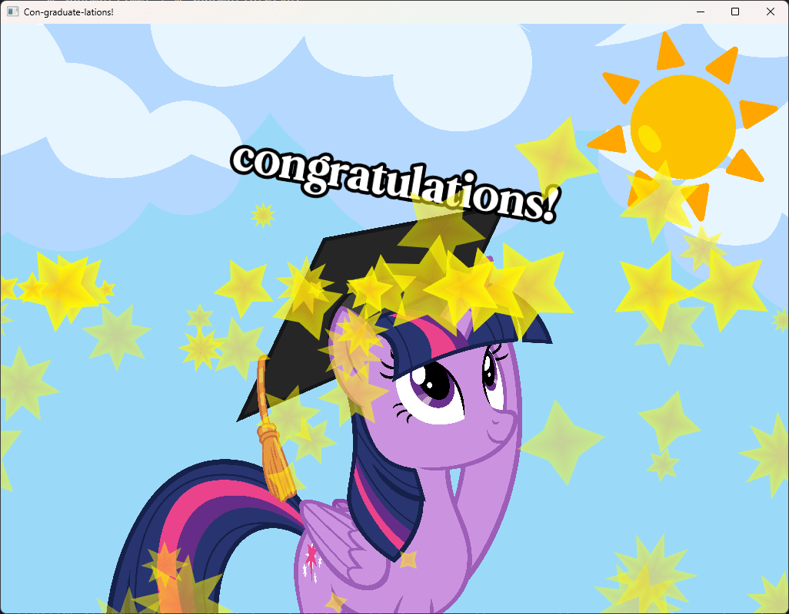

# My Little Diploma 🦄✨: 🎓 Friendship is Graduation!



# How to Run (Windows)

## 1. DOWNLOAD THE PROJECT
Follow one of these options to download and run **Graduation** on your Windows PC:

### Option 1: Download ZIP
- Click the green **"Code"** button on the GitHub page.
- Select **"Download ZIP"**.
- Extract the ZIP file somewhere on your computer.

### Option 2: Clone with Git
- Open **Git Bash** or your terminal.
- Navigate to the folder where you want to download the project.
- Run the following command:
  
```bash
git clone https://github.com/pollyology/Graduation-SFML
```


## 2. MOVE THE ASSETS FOLDER

- Inside the extracted folder, you'll see two folders:
  - `Graduation`
  - `assets`
- Drag the entire **`assets`** folder **into** the `Graduation` folder.  
  It should look like this:

  - `Graduation\`
      - `Graduation.exe`
      - `(SFML .dll files)`
      - `assets`
          - `(images, music, etc.)`


## 3. RUN THE EXECUTABLE

- Open the `Graduation` folder.
- Double-click `Graduation.exe` to launch the program.


## ⚠️ IMPORTANT

- This program only works on **Windows**.
- The `assets` folder **must be inside** the `Graduation` folder or the program will not work.


# HOW TO RUN/DEBUG IN VISUAL STUDIO

To build or debug **Graduation** from source using Visual Studio:

1. **Additional Include Directories:**  
   `C:\SFML\include`

2. **Additional Library Directories:**  
   `C:\SFML\lib`

3. **Additional Dependencies:**  
   *(Paste this at the beginning of the list)*  
   `sfml-graphics-d.lib;sfml-window-d.lib;sfml-system-d.lib;sfml-audio-d.lib;`

# 🎨 Credits

- **Image: Twilight Sparkle Graduate**  
  Artwork by [**AndoAnimalia**](https://www.deviantart.com/andoanimalia/art/Twilight-Sparkle-Graduate-751198353) on DeviantArt  
  > Traced from *My Little Pony: Friendship is Magic*, Season 8 Episode 12: "Marks for Effort."  
  > *My Little Pony: Friendship is Magic* created by **Lauren Faust** and owned by **Hasbro**.  
  > Used in this project with attribution for non-commercial, fan-made purposes.

- **Font: Celsius Flower**  
  By [**Typehill Studio**](https://www.dafont.com/celsius-flower.font) on DaFont  
  > Free for personal use.  
  > Visit [creativefabrica.com](https://www.creativefabrica.com](https://www.creativefabrica.com/designer/typehill/ref/84770/)) for commercial licensing and more fonts.

- **Music: "Remember Summer Days"**  
  By **Anri** — from the 1983 album *Timely!!*  
  [Listen on YouTube](https://www.youtube.com/watch?v=yHKb38-nl3U)  
  > Included in this project for tribute and personal use only.  
  > All rights belong to the original artist and copyright holders.

---

## ✅ Legal Note

This project is a **fan-made digital graduation card** and is **not affiliated with Hasbro, Anri, or Typehill Studio**.  
All media belong to their respective owners. Shared here with respect and proper attribution.
